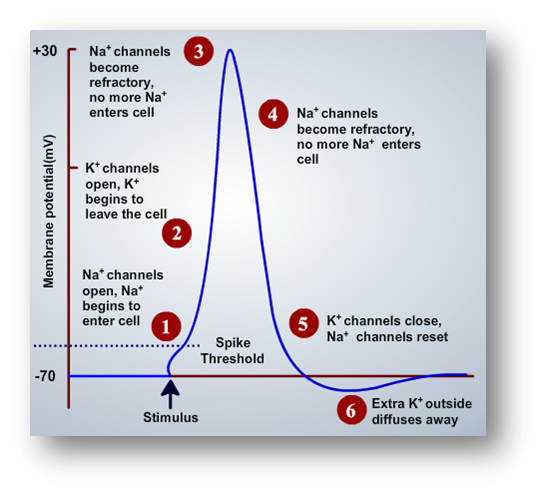

 

Neurons were known to transmit information from one part of the body to another. Though sometimes neurons were considered as analogous to electrical wires, they were not supposed to be good conductors of electricity. Mechanisms such as action potential were evolved to serve the process of information transmission which reflects the analogy to electrical wire. Most commonly referred to as “all or none potential”. Action potentials are the rapidly propagated electrical messages that speed along the axons of the nervous system and over the surface of some muscle and glandular cells. In axons they are brief, travel at constant velocity, and maintain constant amplitude. Like all electrical messages of the nervous system, the action potential is a membrane potential change caused by the flow of ions through ionic channels in the membrane. Cells that can make action potentials can always be stimulated by an electric shock. The stimulus must make a suprathreshold membrane depolarization. This response is a further sharp, all-or-none depolarization, the stereotyped action potential. Such cells are called ELECTRICALLY EXCITABLE. Empirical studies on nervous system indicate that each neuron receives input from several other neurons (say, about 10,000 neurons). All these inputs would be received at various dendritic locations of the neuron. Morphological structure of neuron shows that information transmission happens from dendrites to axon via soma. Each individual neuron receives huge amount of information, considering the fact that they receive inputs from several other neurons. Basically, a neuron acts like an integrator, summing up all the inputs it received (which happens in soma compartment) and when compared to the threshold, it fires an action potential if the summed up value is greater than threshold limit or else it doesn’t fire. A typical schematic representation of action potential could be observed in Figure 1. As the signal (here, action potential) traverses from neuron to neuron, a process called attenuation takes place (weakening of the signal), as earlier mentioned neurons are not good conductors of electricity. Dampening of the signal should be counteracted to ensure the propagation of action potential (signal), which is done by the amplification of signal at the hillock region wherein the concentration of sodium assumed to be the highest when compared to the other parts of the neuron. Entirely electrical arguments showed that there is an exceedingly thin cell membrane whose ion permeability is low at rest and much higher in activity. At the same moment as the permeability increases, the membrane changes its electromotive force and generates an inward current to depolarize the cel. Sodium ions are the current carrier and ENa is the electromotive force. The currents generated by the active membrane are sufficient to excite neighboring patches of membrane so that propagation, like excitation is an electrical process. Two most important properties of axonal action potentials are their high conduction velocity and their brevity and quick recovery. High velocity requires good "cable properties" and an optimal density of rapidly inactivating Na channels. Brevity requires rapid inactivation of Na channels and a high K permeability.

 
&nbsp;

 

**Stages of Action Potential**

 

A typical action potential has four prominent stages:

 

1)    Depolarization phase

 

2)    Re-polarization phase

 

3)    Hyper-polarization phase

 

4)    Resting potential phase

 

Depolarization phase:  Referred to be the starting stage of the action potential. This phase is characterized with opening of voltage-gated sodium channels, wherein the entry of sodium ions stimulates more voltage-gated sodium channels to open, thereby acting like a feedback loop causing a great deal of sodium ions to enter. Inward-rushing Na+ ions would carry the inward current of the active membrane, depolarizing it from rest to near ENa and eventually bringing the next patch of membrane to threshold as well. Hodgkin and Katz(1949) tested their sodium hypothesis by replacing a fraction of the NaCl in seawater with choline chloride, glucose, or sucrose. In close agreement with the theory, the action potential rose less steeply, propagated less rapidly, and overshot less in low-Na external solutions. While voltage-gated sodium channels remain open, voltage-gated potassium channels remain closed. With the increase in sodium ions concentration, the potential raises higher and higher until the sodium ion concentration gets saturated. This was the point when the voltage-gated potassium channel starts to open, so that efflux of potassium ions happens from inside to outside, thereby the increased positive potential starts to reduce which reflects the re-polarization phase.

 

Re-polarization phase: Voltage-gated sodium channels were closed and voltage-gated potassium channels start to open to counterbalance the accumulated positive potential developed inside with the entry of sodium ions. Movement of potassium ions continues until the potential reaches the resting level and drives the potential further below the resting level. Voltage-gated sodium channels and voltage-gated potassium channels were ATP-independent mechanisms.

 

Hyper-polarization phase: The phase extends from the point when it goes below resting level and reaches again back to resting level. The dynamics of voltage-gated potassium channels were slower compared to voltage-gated sodium channels. Due to their slower recovery, more number of potassium ions was driven out taking the potential to below the resting potential. This period is also referred as refractory period. Two types of refractory periods exist: absolute refractory period and relative refractory period. Absolute refractory period refers to the period in which neuron cannot fire an action potential however strong the input is. On the other hand, relative refractory period refers to the definition close to absolute refractory period, only that firing of an action potential could be possible if it receives stronger input.

 

Resting potential phase: This phase refers to the equilibrium state of the neuron. After the refractory period, the potential again returns back to the resting potential. The resting potential or equilibrium potential is determined by Nernst Equation.

 
Biophysical Explanation behind Action Potential:

 

When the neuron is at the resting phase, more number of potassium ions exists inside; less number of sodium ions. On the contrary, outside of the cell have more number of sodium ions and less number of potassium ions. Due to this concentration gradient, there exists passive diffusion of ions across the ion channels even when the cell is at resting phase. The equilibrium potential of each ion is calculated using Nernst equation as shown in Figure 2. Each ion has a specific channel which is ATP-independent and voltage sensitive. The phases explained above like depolarization and repolarization seem to depend on these channels which are specific to particular ions. While the hyperpolarization phase needs to depend on ATP-dependent sodium-potassium pump, which flushes out 3 sodium ions outside and intakes 2 potassium ions inside for each ATP. After the action potential, the pump helps to recalibrate the potential back to the resting state.

 

Changes in neuron permeability depend strictly on the opening and closing of ionic channels. Opening up of sodium channels allows inflow of sodium ions, which happens at the initial stage of the rising of action potential. Upon reaching the threshold, feedback loop is initiated thereby opening more sodium channels which allow more number of sodium ions causing more depolarization. Voltage-gated sodium channels have two types of gates:

 

a)    Voltage-sensitive gate.

 

b)    Time-sensitive gate.

 

As the name refers, voltage-sensitive gate is sensitive to voltage whose opening and closing is regulated by voltage. Time-sensitive gate gets inactivated after a specified time thereby preventing inflow of sodium ions. The time-sensitive gate only allows the inflow of sodium ions for a specific time period, wherein the inflow of sodium ions is inactivated. Upon reaching the peak, the sodium channels started to close, interrupting feedback loop and at the same time potassium channels start to open slowly. With the flow of sodium ions, positive atmosphere is developed inside the cell and comparatively negative atmosphere outside. To counterbalance this situation, potassium ions start to move outside until it reaches the hyperpolarization phase due to its slow ion-channel dynamics.
